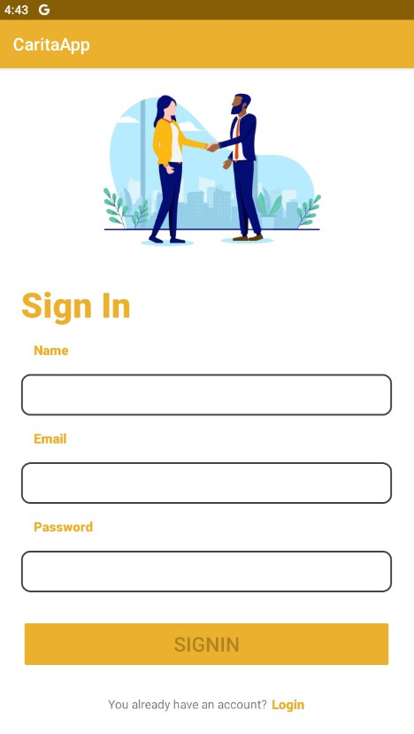
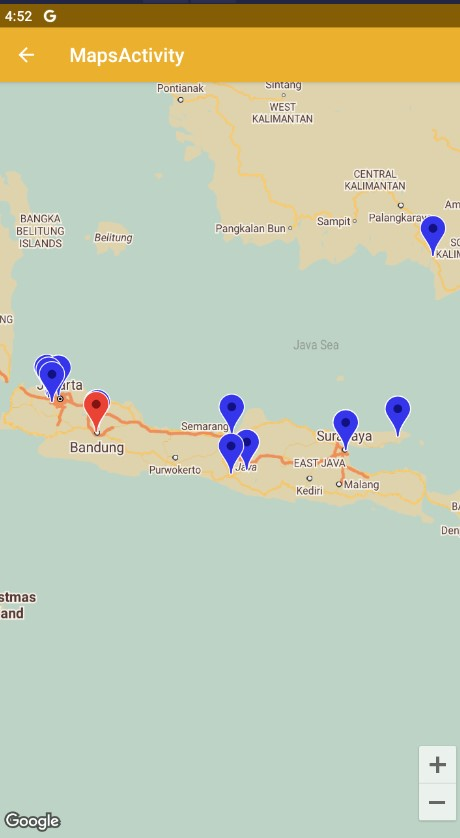
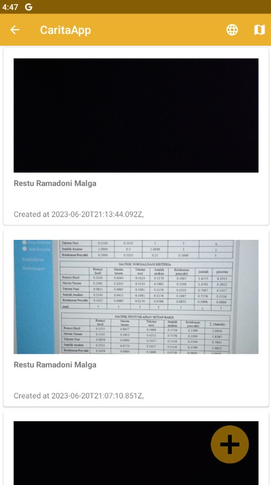
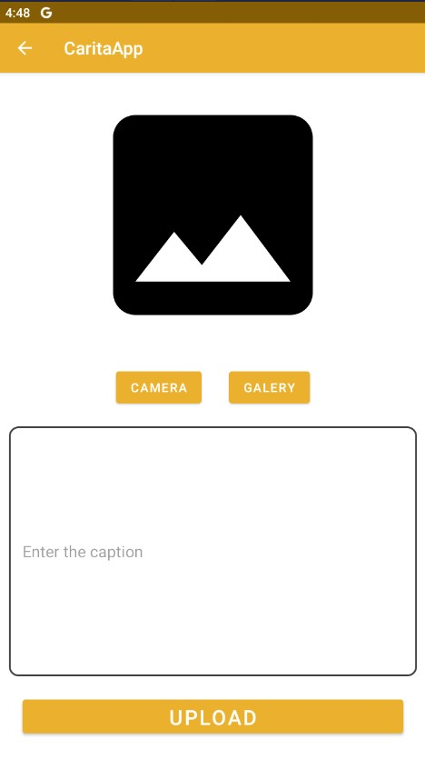
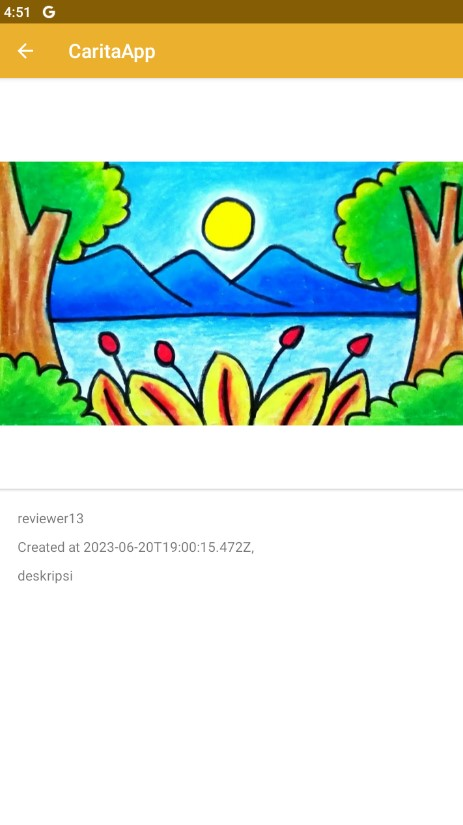

# Submission_Dicoding-Android_Intermediate
Dibuat oleh Reynhard Powiwi 👨‍💻

## Carita App 📖🌍
Carita App adalah platform berbagi cerita yang memungkinkan pengguna untuk membagikan cerita mereka dan menandainya pada peta interaktif. Dengan menggunakan CeritaKu, pengguna dapat menemukan cerita menarik dari berbagai lokasi di seluruh dunia.

## Fitur ✨

- **Berbagi Cerita:** Pengguna dapat membuat postingan cerita dengan mengunggah gambar, menulis deskripsi, dan menandai lokasi cerita tersebut pada peta.
- **Peta Interaktif:** 🗺️ Peta interaktif menampilkan pin untuk setiap postingan cerita, sehingga pengguna dapat dengan mudah menjelajahi dan menemukan cerita dari berbagai lokasi.

## Screenshot Aplikasi 📷
Berikut adalah beberapa screenshot dari aplikasi Carita App:

- Autentikasi

   

- Maps

- Story

   

Selamat mencoba 😉✨
